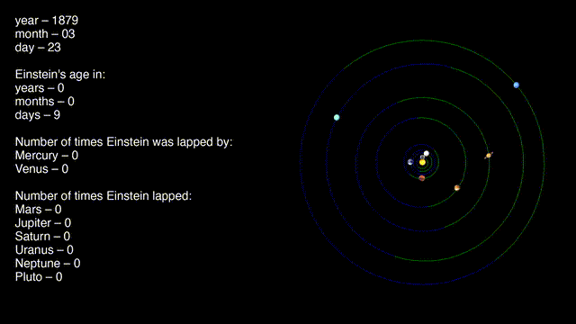

# Solar System Live - Video Generator

This repository is a fork of [Fourmilab's Solar System Live](https://github.com/Fourmilab/solar_system_live) with added tooling to generate animated videos of the solar system over time.

Perfect for creating unique birthday videos! Generate time-lapse animations showing how the solar system evolved during someone's lifetime, complete with customizable text overlays showing dates, ages, and planetary orbital statistics. Watch as planets orbit while tracking how many times Earth (or your friend) was lapped by Mercury and Venus, or how many times they lapped the outer planets.

**Note:** This repository is macOS-focused (setup scripts and instructions assume macOS/Homebrew), but you can probably adapt it to work on other Unix-like systems (Linux, BSD, etc.) with appropriate modifications to paths and package managers.

## Example Video

Here's a sample video generated using Einstein's birth and death dates (1879-03-14 to 1955-04-18):

[](docs/einstein-timelapse-example.mp4)

*(Click the animated GIF above to view the full video)*

## Quick Start

### Prerequisites

- **Lighttpd** (install via Homebrew: `brew install lighttpd`)
- **Pillow** (install via Homebrew: `brew install Pillow`)
- **Python 3**
- **ffmpeg** (install via Homebrew: `brew install ffmpeg`)

### Setup

1. **Stage a local runnable tree:**

   From the repo root:

   ```zsh
   scripts/macos_local_lighttpd_install.sh
   ```

   This will create `./local/` with:
   - `local/htdocs/` (copy of `webtree/`)
   - `local/cgi-bin/Solar.cgi` (CGI executable)
   - `local/cgi-executables/` (runtime assets the CGI loads at runtime)
   - `local/lighttpd.conf` (ready-to-run Lighttpd config)

2. **Run Lighttpd:**

   ```zsh
   lighttpd -D -f ./local/lighttpd.conf
   ```

3. **Verify it's working:**

   Open `http://127.0.0.1:8080/cgi-bin/Solar` in your browser. The page should render and the generated image should load.

### Generating Videos

Once you have Lighttpd running locally, you can generate animated videos using:

```zsh
python3 scripts/generate_solar_frames.py <birth-date>
```

**Required argument:**
- `birth-date`: Start date in `YYYY-MM-DD` format (e.g., `1879-03-14`)

**Optional arguments:**
- `--end-date YYYY-MM-DD`: End date (default: today's date)
- `--step-days N`: Number of days to step forward between frames (default: 3)
- `--name NAME`: Name to display in age text (optional; if omitted, the heading will be `Age in:`)

**Examples:**

```zsh
cd /path/to/solar_system_live

# Generate frames and video from 1879-03-14 (birth date) to today, stepping 7 days
python3 scripts/generate_solar_frames.py 1879-03-14 --step-days 7

# Generate frames and video from 1879-03-14 to 1955-04-18, stepping 7 days, with a name
python3 scripts/generate_solar_frames.py 1879-03-14 --end-date 1955-04-18 --step-days 7 --name Einstein

# Generate frames and video from 1879-03-14 to today, stepping 7 days, with a name
python3 scripts/generate_solar_frames.py 1879-03-14 --step-days 7 --name Einstein
```

### What the Script Does

The script will:

1. Generate GIF frames by querying the local Solar CGI for each date in the range
2. Create a directory `frames/` populated with files like:
   - `frames/frame_00001.gif`
   - `frames/frame_00002.gif`
   - …
3. Add text overlays to each frame showing:
   - Year, month, and day
   - Age in years, months, and days (with optional name)
   - Number of times Earth (or named person) was lapped by inner planets (Mercury, Venus)
   - Number of times Earth (or named person) lapped outer planets (Mars, Jupiter, Saturn, Uranus, Neptune, Pluto)
4. Build a 1080p, 30 fps H.264 video (`solar_timelapse.mp4`) with:
   - Solar images right-aligned (1024px wide)
   - White Helvetica text left-aligned on a black background
   - All frames stitched together at 30 fps

---

## Original Solar System Live

This repository is a fork of [Fourmilab's Solar System Live](https://github.com/Fourmilab/solar_system_live), originally created by [John Walker](https://www.fourmilab.ch/).

### About Solar System Live

[*Solar System Live*](https://www.fourmilab.ch/solar/) is an interactive orrery for the Web that lets you view the solar system in a variety of ways for any date between 4713 B.C. and A.D. 8000. An ephemeris can be displayed for any location on Earth and, given orbital elements in the form published in the IAU Circulars and the Jet Propulsion Laboratory, the orbit and position of asteroids and comets can be plotted.

This repository maintains the master copies of the Solar System Live Web application source code and the Web tree for the program.

### Structure of the Repository

This repository is organized into the following directories.

* **webtree**: Replica of the Web tree from the Fourmilab site containing all of the HTML documents, and images. These pages contain relative references to style sheets, icons, and other resources on the Fourmilab Web site and will not display properly without modification in other environments.

* **src**: Source code for the Solar System Live program, which runs as a Common Gateway Interface (CGI) application invoked by a Web server processing a user request.

* **scripts**: Helper scripts, including tools for running a local Lighttpd instance and generating image sequences for video.


